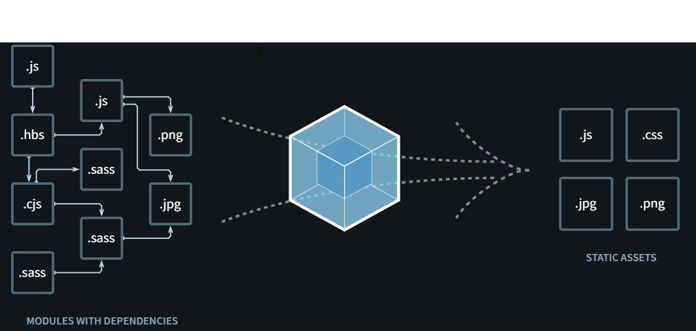

# WEBPACK UP AND RUNNING

## The fundamentals of Webpack 5

Essentially, Webpack is a module bundler for JavaScript applications. Webpack takes a
series of JavaScript files, along with dependencies such as image files, which make up an
application, and constructs something called a dependency graph. A dependency graph is a
representation of how these files and dependencies are ordered and linked within an
application and shows how the files interact with each other.

This dependency graph then forms a template that the bundler follows when taking all of
the dependencies and files to compress them into a smaller set. Webpack is then able to
bundle these files into a larger, but usually less-numerous, set of files. This eliminates
problems such as unused code, repetitive code, and the need for rewriting. To some extent,
the code can be formatted more succinctly.

Webpack recursively builds every module in your application, then packs all those
modules into a small number of bundles. For the most part, a bundled application will
contain a script that is ideal to be read by a program, such as a web browser, but too
complicated for a programmer to use. The developer, therefore, will take a set of source
files and make changes to this area of the program, then bundle this source into an
output—a bundled application.

Bundling was originally intended to improve browser-reading performance, but it also has
many other advantages. Once a set of source files is bundled by Webpack, it will usually
follow a systematic and conventional filing structure. Errors within the code can halt a
bundling operation; this book will instruct you on how to overcome these problems.

Now, let's explore the general concepts around Webpack 5.

## General concepts behind Webpack 5
Here, we will begin to understand the key concepts and the purpose of Webpack, rather
than expect you to have any prior understanding of it. Bundling is carried out locally on a
desktop using Node.js or npm and the command-line interface (CLI), usually Command
Prompt.

Webpack is a build tool that puts all of your assets into a dependency graph. This includes
JavaScript files, images, fonts, and Cascading Style Sheets (CSS). It will take Sassy
CSS (SCSS) and TypeScript files and place them into CSS and JavaScript files, respectively.
Webpack will only be able to do this when the code is compatible with the latter format.

When programming in JavaScript and other languages, the source code will often use a
statement such as require(), which points one file to another. Webpack will detect this
statement and determine the file that is needed as a dependency. This will decide how the
files are processed in your final JavaScript bundle. This will also include replacing a URL
path to a content delivery network (CDN)—which is, essentially, a network of proxy
servers—with a local file.

The following diagram is a representation of the general purpose of Webpack, which is to
take a set of files or dependencies and output the content in an optimized form:

Now, let's take a closer look at some of the terminology, which you may be unfamiliar with
but can be considered common parlance when using Webpack.